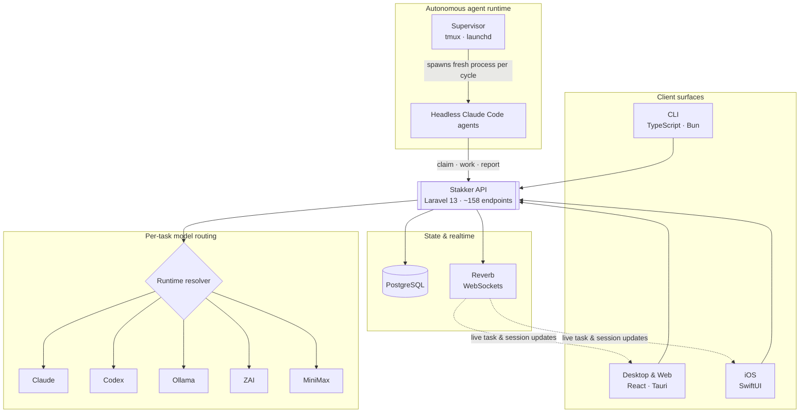
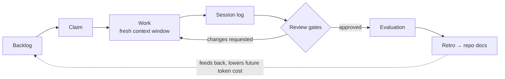

# Stakker

**A production control plane for running fleets of autonomous coding agents.**

Stakker orchestrates fleets of long-lived, headless AI coding agents - alongside humans - working a shared backlog across many codebases. Every unit of work follows a measured lifecycle (claim → work → session log → review → evaluation → retro) deliberately designed to keep each agent's context window small and its token cost observable, so autonomous development stays both affordable and accountable at scale.

> This repository is a **showcase**: architecture, design and engineering write-up only. The source is commercial and private - a walkthrough or supervised code read is available on request.

---

## Architecture

One Laravel API is the single source of truth; five surfaces consume it - a CLI (the shared human **and** agent interface), a desktop/web app, a native iOS client, and the autonomous supervisor that runs the agents themselves.

## How an agent works a task

Each cycle spawns a **fresh** agent process so context starts empty - bounded by per-cycle timeouts, with live log streaming, API heartbeats and filesystem "nudge" controls (wake / pause / restart). Reviews and retros feed structured learning back into each repo, so the cost of the *next* task on that codebase goes down.

---

## Selected engineering

- **Autonomous agent runtime.** Spawns headless `claude -p` processes per work cycle with empty starting context, per-cycle timeouts, heartbeats and live control - supervised in `tmux` with a `launchd` daemon for boot persistence, scaling to agent "farms" across multiple codebases simultaneously.
- **Per-task model & provider resolution.** Agents carry preferred model/runtime; the API resolves the concrete model, runtime and rule-set per task across **five inference runtimes** (Claude, Codex, Ollama, ZAI, MiniMax).
- **LLM token economics.** Prompt-cache-aware accounting (cache reads billed at a fraction of input), per-model pricing, and usage aggregated by project, agent and provider - cost is a first-class, queryable metric, not an afterthought.
- **Governance & safety.** Automated code / design / security review gates, agent-health circuit-breakers (e.g. repeated change requests or unresolved escalations pause an agent), and fine-grained human-vs-agent authorisation — agents may claim, transition and comment on their own work; destructive actions stay human-only.
- **Realtime.** Laravel Reverb WebSocket broadcasting pushes live task and session updates to every client.

## Tech stack

| Component | Built with |
|---|---|
| **API** | PHP 8.3 · Laravel 13 · PostgreSQL · Sanctum · Reverb (WebSockets) · Docker |
| **CLI** | TypeScript · Bun · Commander — the shared human + agent interface |
| **Desktop & Web app** | React 19 · Vite · Tauri 2 (Rust shell) · TanStack · Tailwind / shadcn |
| **iOS** | Swift · SwiftUI (native client) |
| **Supervisor** | Bash · tmux · launchd — the autonomous agent runtime |
| **Docs** | Docusaurus · Bruno (API collections) |
| **Quality** | PHPUnit · bun:test · Vitest · XCTest · Semgrep · GitHub Actions CI |

## At a glance

| | |
|---|---|
| Repositories | **6** (API, CLI, desktop/web, iOS, supervisor, docs) |
| API endpoints | **~158** across 51 controllers, 20 models |
| Client surfaces | **5** consuming one API |
| Inference runtimes | **5** (Claude · Codex · Ollama · ZAI · MiniMax) |
| Automated tests | **~344** (PHPUnit · bun:test · Vitest · XCTest) |
| CI | GitHub Actions on every repo · Semgrep static analysis |
| Built by | **1** engineer, solo |

---

Source is commercial and private. Architecture walkthrough or supervised code read available on request — **john@johncbaker.co.uk** · [github.com/johncbaker](https://github.com/johncbaker)
